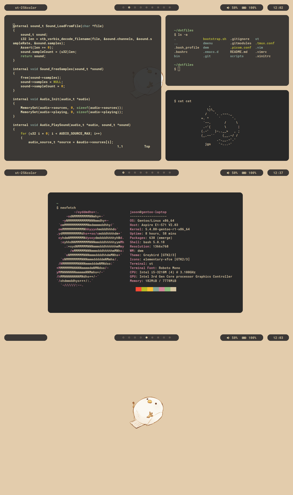

    

    Looking for my older dotfiles? Visit the
    <a href="https://github.com/jasonliang-dev/dotfiles/tree/archive">archive branch</a>.

#### Required by dwm:

- **[my build of dmenu](https://github.com/jasonliang-dev/dmenu/)**
- **st**

#### Required by `~/scripts/startup.sh`:

- **feh** - to display wallpaper
- **[picom with rounded corners](https://github.com/ibhagwan/picom)**

#### Required by `~/scripts/bar.sh`:

- **[lemonbar with xft](https://gitlab.com/protesilaos/lemonbar-xft)** - lemonbar patch for non-bitmap fonts
- **jq** - parse tag/workspace info
- **xprop** - window info
- **acpi** - battery info
- **amixer** - volume info

#### Fonts:

- **Roboto Mono** - required by dwm, lemonbar, st, and emacs
- **Font Awesome 5** - required by `~/scripts/bar.sh`
