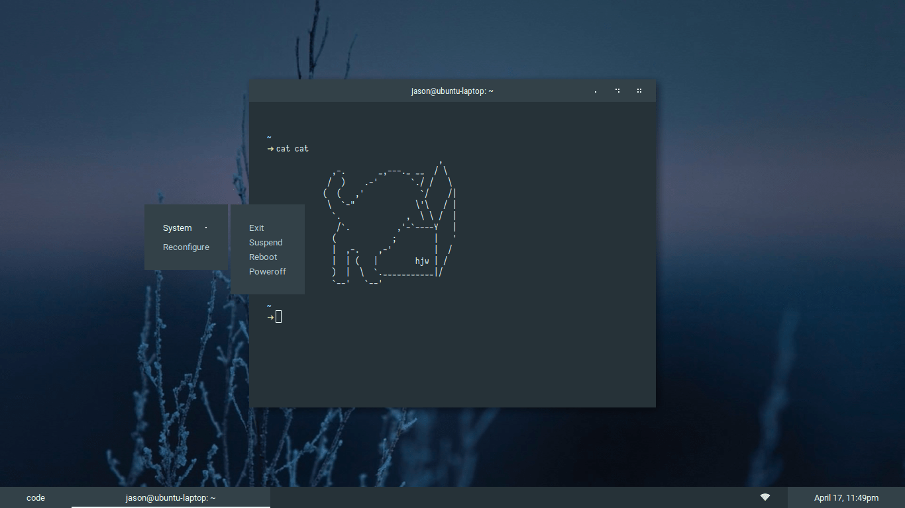

<h1 align="center">Dotfiles</h1>

  

  My collection of configuration files.

## Yabai

- **Font**: Iosevka Bold
- **Terminal**: iTerm2
- **Bar**: Übersicht
- **Text Editor**: Vim
- **Cat**: [cat](./cat/cat)

## Openbox

- **Font**: Roboto
- **Terminal**: `gnome-terminal`
- **Terminal Font**: Iosevka
- **Bar**: `tint2`
- **Cat**: [cat](./cat/cat)

## i3

- **Font**: Source Sans Pro
- **Terminal**: `gnome-terminal`
- **Terminal Font**: Iosevka
- **Bar**: `polybar`
- **File Explorer**: `ranger`
- **Text Editor**: Vim
