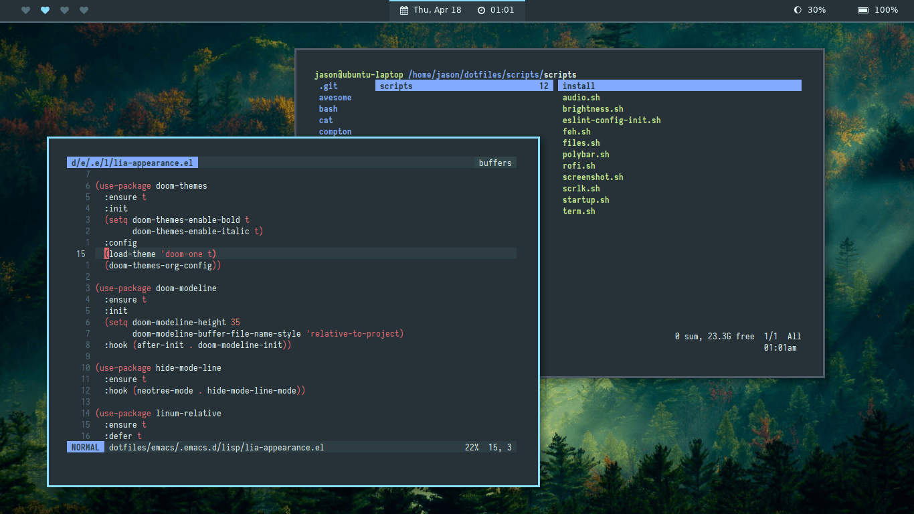
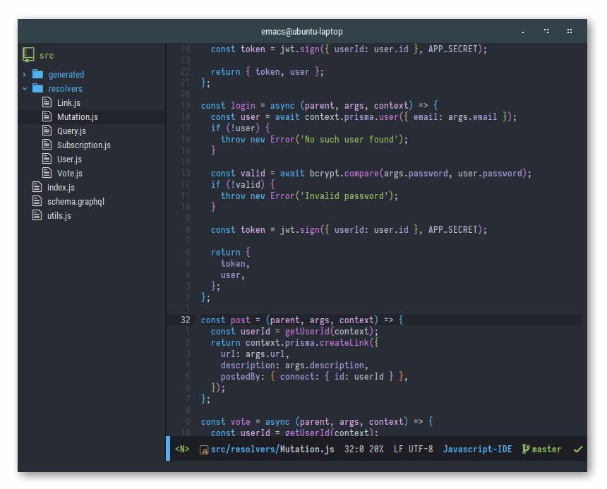
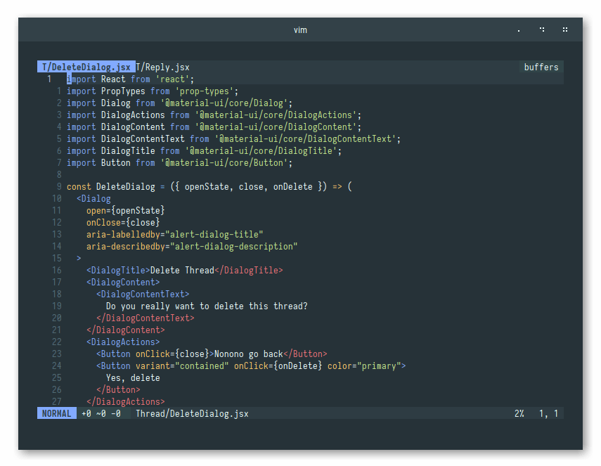

## Openbox

- **Font**: Roboto
- **Terminal**: `gnome-terminal`
- **Terminal Font**: Iosevka
- **Bar**: `tint2`
- **Cat**: [cat](./cat/cat)

## i3

- **Font**: Source Sans Pro
- **Terminal**: `gnome-terminal`
- **Terminal Font**: Iosevka
- **Bar**: `polybar`
- **File Explorer**: `ranger`
- **Text Editor**: Vim

## Emacs

- **Editor Font**: Iosevka
- **Tree Font**: Roboto Condensed
- **Theme**: `doom-one` from [doom-themes](https://github.com/hlissner/emacs-doom-themes)

## Vim

- **Colorscheme**: [base16](https://github.com/chriskempson/base16-vim) (`base16-material`)
- **Statusline**: [vim-airline](https://github.com/vim-airline/vim-airline)
